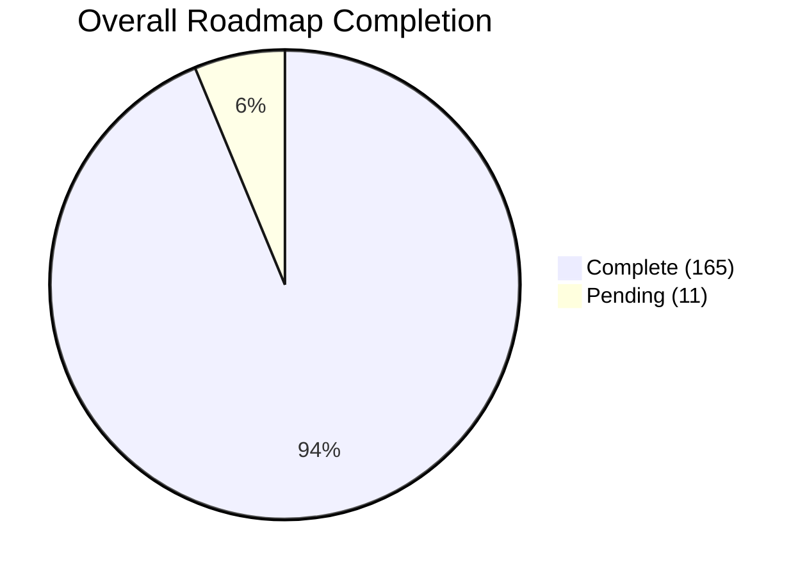
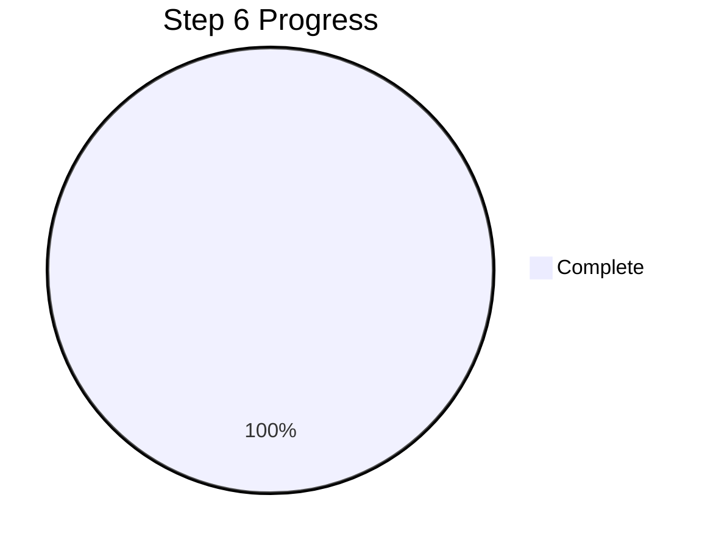
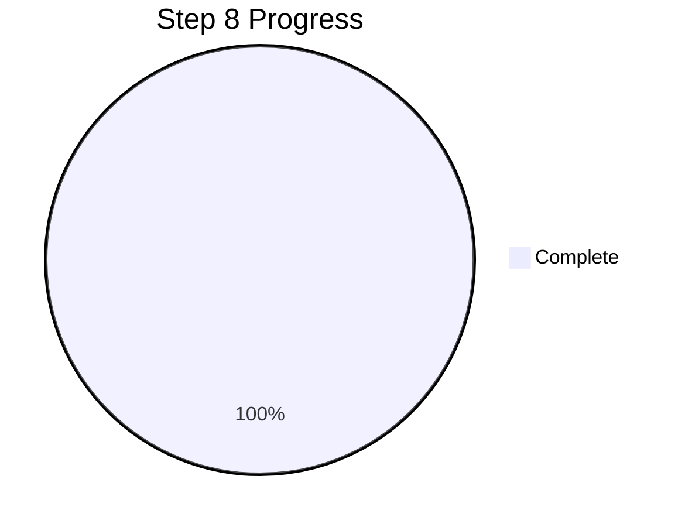
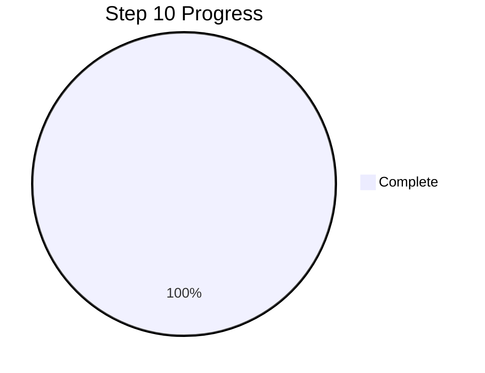
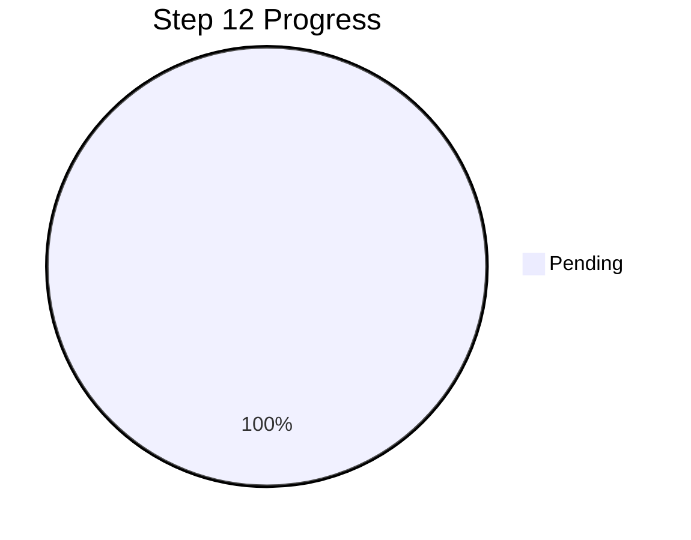

# COMPLETION REPORT
**Traceveil roadmap reconciliation, delivery status, and contribution record**

**Prepared:** 2026-09-25

**Source set:** Roadmap, frontend completion audit, batch and Steps 9–11 practical-usability and verification records, contribution record, and verified repository history through `7ef17c6`.

**Repository snapshot:** `7ef17c6` on branch `main` following the merge of PR #28.

## Executive Summary

**Project Delivery Status & Trajectory**

Traceveil now provides an integrated investigation platform spanning evidence intake, deterministic analysis, safe visual exploration, grounded local-AI assistance, real-time browser delivery, and approval-gated reporting and notification automation. The software roadmap is complete through Step 11; the remaining Step 12 items require physical hardware acceptance.

**Key Recent Achievements:**
- **Batch Processing Attained:** The system securely ingests, validates, and normalizes evidence into canonical events. The deterministic analysis engine is actively generating bounded risk scores, timelines, and analytical projections (Steps 3, 4, 6, and 8).
- **Live IoT Intake Established:** Authenticated HTTP intake, durable sessions, and controlled telemetry simulators are now fully implemented, bridging the gap between hardware sensors and our investigation backend (Step 5).
- **Usability Readiness:** The platform has passed the strict requirements of the *Batch Practical Usability Checklist*, meaning it is ready for the second-review university showcase.
- **Blind Evaluation Added:** HAI industrial telemetry and IoT-23 network flows can now be evaluated without their original answer labels. Traceveil uses behavioural and deterministic rules and preserves the exact reason for each classification.
- **Classification Made Explicit:** Dataset-supplied labels such as DDoS are visibly separated from Traceveil-discovered findings. Risk output now exposes classification source, confidence, evidence confidence, factors, and penalties.
- **Dense and Mixed Cases Hardened:** Incident grouping is bounded and time-aware, artifact identifiers remain unique, dense timelines are paged, anomalous activity windows preserve cause attribution, and datasets converge only through genuine time/device/network context.
- **Dataset and Case UX Completed:** Curated samples, checksums, device inventory, automatic beginner-friendly case descriptions, compact case rows, and a full Case Overview explanation are implemented.
- **Safe Visual Analysis Completed:** Six focused views—timeline, event activity,
  top entities, severity mix, entity relationships, and top findings—resolve
  persisted data through versioned allow-listed layouts. Visuals are pinned to
  the originating message and analysis snapshot, and Automatic mode chooses the
  view deterministically from question intent.
- **Grounded Local-AI Chat Completed:** Durable sessions support natural chat,
  explicit evidence inclusion, case and selected-record scope, verified
  citations, offline deterministic completion, history restoration, scrolling,
  cancellation, retry, and message-linked visuals.
- **AI Runtime Clarity and Performance Completed:** System Status separates AI
  generation from the Ollama runtime, provides independent controls and model
  details, and reports context/request limits. Bounded recent history, smaller
  prompts and outputs, and model keep-alive reduce response latency.
- **Investigation Workspace UX Completed:** The assistant now uses a compact,
  chat-first two-pane layout with clearer messages, reduced global chrome,
  unified readable selectors, a refined evidence control, and a persistent
  visual workspace. Investigators can keep multiple response visuals open,
  reorder them by dragging, close them individually, and open a focused preview.
- **Real-Time Delivery Completed:** Step 7 now provides SSE delivery, replay and reconnect handling, authoritative recovery, scope-isolated buffers, backend-authored device state, and response-order guards without changing forensic calculations.
- **Reporting and Notification Automation Completed:** Step 11 now provides deterministic incident summaries, report export, grounded alert and incident drafts, investigator approval, SMTP delivery controls, automatic processing and grouping, and atomic audit history.
- **Mainline Integration Completed:** PR #28 merged the verified Steps 7 and 11 delivery into `main` at `7ef17c6` after all required GitHub checks passed.

**Overall Progress:**
The reconciled roadmap contains **176 planned sub-items**, of which **165 are implemented and verified**, for a formal completion rate of **93.8%**. Steps 7 and 11 are complete in addition to the previously completed software areas. The **11 remaining items** are confined to the physical demonstration and hardware acceptance in Step 12.

---

## Roadmap Completion by Area & Detailed Checklist

### 1. Initialization (Complete)

- [x] Set up React + Vite frontend
- [x] Set up FastAPI backend
- [x] Set up SQLite
- [x] Install required libraries
- [x] Connect frontend and backend
- [x] Add Ollama configuration and optional availability/model health checks
- [x] Install Ollama, pull the selected Qwen 9B Q4_K_M model, and verify it locally

### 2. Frontend and Investigation Interface (Complete)

- [x] Build the initial Step 1 service-status shell
- [x] Build the global application layout and navigation
- [x] Build case pages
- [x] Build evidence upload/import page
- [x] Build main investigation dashboard
- [x] Add metric and severity cards
- [x] Add evidence tables
- [x] Add chart placeholders
- [x] Add incident timeline placeholder
- [x] Add device/entity graph placeholder
- [x] Add recommendations/findings panels
- [x] Add live monitoring status indicators
- [x] Add live event feed
- [x] Add live alert feed
- [x] Add device connection/status components
- [x] Add chat section
- [x] Add email/report sections
- [x] Use structured mock data before backend feature integration

### 3. Input Check and Evidence Validation (Complete)

- [x] Accept supported evidence file types
- [x] Check file size and structure
- [x] Validate required columns
- [x] Detect missing or invalid values
- [x] Hash and store evidence metadata
- [x] Preserve source metadata
- [x] Return structured validation errors for later API/frontend integration
- [x] Define validated live telemetry input contracts
- [x] Validate incoming device identifiers and event types
- [x] Reject malformed live telemetry
- [x] Record live ingestion timestamps
- [x] Preserve source/device provenance for live evidence
- [x] Validate the pinned CASAS Milan CSV projection
- [x] Validate the pinned TON_IoT fridge telemetry subset
- [x] Require pytest to terminate cleanly in CI

### 4. Canonical Event Model and Normalization (Complete)

- [x] Create the common canonical event schema
- [x] Map simulated data
- [x] Map CASAS Milan smart-home sensor data
- [x] Map TON_IoT fridge device telemetry
- [x] Retain TON_IoT network data as a secondary compatibility adapter
- [x] Retain CICIoT2023 network data as a secondary compatibility adapter
- [x] Standardize timestamps
- [x] Standardize device and entity fields
- [x] Preserve source row references
- [x] Create a live telemetry adapter
- [x] Normalize live device events into the canonical event model
- [x] Preserve live source and ingestion metadata

### 5. Live IoT Integration (Complete)

- [x] Select the Arduino-compatible microcontroller
- [x] Select the IoT test device or endpoint
- [x] Define the controlled laboratory topology
- [x] Define the live telemetry message format
- [x] Implement device-to-backend telemetry transport
- [x] Support MQTT and/or HTTP based on the chosen implementation
- [x] Build the backend live event collector
- [x] Add device registration/identification
- [x] Add connection and heartbeat status
- [x] Store accepted live telemetry as evidence
- [x] Forward normalized live events into the common analysis pipeline
- [x] Prepare controlled suspicious-event scenarios for demonstration
- [x] Verify end-to-end live ingestion

### 6. Filtering, Detection, Risk and Correlation (Complete)

- [x] Add deterministic filters
- [x] Add stable sorting
- [x] Add detection rules
- [x] Add behavioural baselines
- [x] Add bounded risk scoring
- [x] Add event correlation
- [x] Build incident timelines
- [x] Generate graph data
- [x] Generate chart-ready aggregates
- [x] Support analysis of both batch and live events
- [x] Trigger alerts from qualifying live events

### 7. Real-Time Event Delivery (Complete)

- [x] Add backend real-time event delivery
- [x] Select SSE or WebSocket transport based on implementation needs
- [x] Stream accepted live events to the frontend
- [x] Stream generated alerts to the frontend
- [x] Update device status in near real time
- [x] Update timelines when relevant live events arrive
- [x] Update dashboard metrics from validated backend data
- [x] Handle temporary frontend/backend disconnections
- [x] Add safe reconnect behaviour
- [x] Ensure real-time delivery does not alter forensic calculations

### 8. Dashboard Results and Investigation APIs (Complete)

- [x] Create APIs for cases
- [x] Create APIs for evidence validation and retrieval
- [x] Create APIs for events
- [x] Create APIs for alerts
- [x] Create APIs for incidents
- [x] Create APIs for timelines
- [x] Create APIs for graphs and chart data
- [x] Connect real analytical results to the dashboard
- [x] Expose risk breakdowns through investigation APIs
- [x] Expose supporting evidence identifiers through investigation APIs
- [x] Expose provenance/source references through event APIs
- [x] Add refresh controls
- [x] Add reanalysis controls
- [x] Allow historical review of persisted batch analysis snapshots and incidents
- [x] Preserve the selected snapshot across result tabs and browser refreshes
- [x] Verify generated OpenAPI types and connected frontend workflows in CI
- [x] Document genuine live-incident history as deferred to Steps 5 and 7

### 9. Visualization Engine + Qwen (Complete)

- [x] Create allowed visualization components
- [x] Create and validate versioned layout JSON
- [x] Allow only deterministic data references
- [x] Let Qwen summarize validated results
- [x] Let Qwen choose safe visualization layouts
- [x] Reject unknown components and fields
- [x] Reject invented numerical values
- [x] Reject unsafe output
- [x] Add deterministic fallback layouts
- [x] Support visualization of both historical and live investigation data
- [x] Offer a focused analysis set: timeline, event activity, top entities, severity mix, entity relationships, and top findings
- [x] Route Automatic mode deterministically from the investigation question
- [x] Pin each response visual to the analysis snapshot used for that message
- [x] Reopen visuals from older chat responses without showing stale canvas data
- [x] Preserve legacy saved layouts while hiding superseded views from new selections

### 10. AI Investigation Chat (Complete)

- [x] Add case-based chat
- [x] Answer questions using selected evidence
- [x] Explain alerts
- [x] Explain risk scores
- [x] Explain correlations
- [x] Explain live incident sequences
- [x] Return evidence references
- [x] Save chat history
- [x] Handle Qwen being offline
- [x] Separate normal conversation from evidence-grounded investigation mode
- [x] Respond naturally to greetings and ordinary questions without retrieving case evidence
- [x] Resolve explicit case names before cross-case retrieval
- [x] Add independent AI-generation and Ollama runtime controls in System Status
- [x] Show model, installation, context-window, request-budget, and availability details
- [x] Bound recent conversation context and model output for faster responses
- [x] Fix durable history restoration, scrolling, cancellation, retry, and per-message visual state

### 11. Alerts, Email, Reports and Automation (Complete)

- [x] Add SMTP setup
- [x] Generate alert email drafts
- [x] Support drafts for live detected incidents
- [x] Require investigator approval before sending
- [x] Add report export
- [x] Auto-run analysis after batch upload
- [x] Automatically process validated incoming live events
- [x] Auto-group related alerts
- [x] Create deterministic incident summaries before AI narration
- [x] Preserve alert and notification audit history

### 12. Physical Live Demonstration (Pending)

- [ ] Assemble the Arduino and IoT laboratory setup
- [ ] Verify normal device telemetry
- [ ] Verify live dashboard updates
- [ ] Execute a controlled simulated suspicious scenario
- [ ] Confirm the detection rule triggers
- [ ] Confirm a live alert appears
- [ ] Confirm the event is persisted as evidence
- [ ] Confirm the incident timeline updates
- [ ] Confirm device/entity relationships are visible
- [ ] Confirm the captured incident can be investigated after the live event
- [ ] Document the complete demonstration procedure

### 13. Dataset Intelligence, Classification Transparency, and Analysis UX (Complete — J3DI)

- [x] Centralize the reusable dataset catalog — **J3DI**
- [x] Curate practical HAI, IoT-23, TON_IoT, CASAS, and simulation samples — **J3DI**
- [x] Add schema-contract fixtures and checksums — **J3DI**
- [x] Document the represented devices, canonical identities, and camera involvement — **J3DI**
- [x] Preserve reproducible sample-building tools without retaining bulky full archives — **J3DI**
- [x] Add label-free HAI ICS and IoT-23 evidence profiles — **J3DI**
- [x] Add a normalized attack-classification taxonomy — **J3DI**
- [x] Preserve classification provenance as dataset label, deterministic rule, or behavioural anomaly — **J3DI**
- [x] Separate supplied attack labels from independently discovered findings — **J3DI**
- [x] Add telemetry baseline and rate-of-change anomaly detection — **J3DI**
- [x] Add network fan-out, port-fan-out, and connection-failure detection — **J3DI**
- [x] Add classification/evidence confidence to explainable risk output — **J3DI**
- [x] Bound and time-split dense incident groups — **J3DI**
- [x] Prevent analysis-artifact identifier collisions on large imports — **J3DI**
- [x] Persist activity-window anomaly and cause attribution — **J3DI**
- [x] Converge mixed evidence only through genuine temporal or entity context — **J3DI**
- [x] Page dense timelines and lazy-load expanded records — **J3DI**
- [x] Prevent blank/stale timeline state during route changes — **J3DI**
- [x] Add classification, risk, incident, entity, and spike explainers — **J3DI**
- [x] Generate beginner-friendly single- and multi-dataset case descriptions — **J3DI**
- [x] Add compact case-row hover text and a full Case Overview description panel — **J3DI**

**Acceptance evidence:** Backend regression coverage verifies blind detection,
classification provenance, bounded incident references, unique artifact IDs,
activity-window attribution, mixed-case convergence, and automatic description
updates. Frontend regression coverage verifies timeline paging/navigation,
classification/risk explanations, incident and entity context, spike attribution,
compact case rows, and the Case Overview dataset panel.

---

## Team Ownership & Contributions

The repository contains 73 commits at the recorded `main` snapshot.

**J3DI (Project Lead)** - *60 verified commits across the J3DI and J3DI-19 author identities*
- **Role:** Documentation, planning, merging, review, and integration oversight.
- **Key Deliverables:** Repository foundation, frontend architecture, three-phase integration, dataset-scope corrections, blind-evaluation datasets, classification transparency, anomaly attribution, mixed-case analysis, bounded incident handling, case-description UX, safe persisted visualizations, grounded AI chat, local-AI runtime controls, and the compact interactive assistant workspace.
- **Latest Delivery:** `a94a0fa` removed the redundant settings workspace and simplified the connected application shell. J3DI also merged the refreshed documentation and PR #28, bringing the completed Steps 7 and 11 work into `main` as `7ef17c6`.

**Aarya (Contributor)** - *10 Commits*
- **Role:** Backend and Analysis Engineering
- **Key Deliverables:** Step 3 (Evidence Validation), Step 4 (Canonical Normalization), Step 6 (Deterministic Analytics), and Step 8 (Investigation APIs & Workflows).

**Ayra (Contributor)** - *3 verified commits in the repository history*
- **Role:** IoT & Live Integration Engineering
- **Key Deliverables:** Step 5 live IoT integration; Step 7 real-time SSE delivery and safe reconnect recovery; and Step 11 alert, email, report, automation, and notification-audit workflows.

## Verification and Acceptance Record
- **Frontend tests:** Passing
- **Backend/API/persistence tests:** Passing
- **TypeScript and lint:** Passing
- **Production build:** Passing
- **OpenAPI contract and generated frontend types:** Synchronized and passing
- **Batch Usability Showcase:** Passed integration and usability gate across Steps 1, 2, 3, 4, 6, and 8.
- **Steps 9–10 regression pass:** Full backend suite passed; full frontend suite passed (92 tests across 15 files); TypeScript lint and the production Vite build passed.
- **Steps 7 and 11 completion pass:** The full backend suite passed 243 tests with a clean exit; all 143 frontend tests, TypeScript checking, the production build, and OpenAPI contract verification passed.
- **Mainline CI acceptance:** PR #28 passed backend clean-exit, frontend contract/tests, Step 5 backend, bridge broker, native C++, and ESP32 compilation checks before merge.
- **Live AI/visual acceptance:** `qwen35-uncensored:latest` returned grounded responses while deterministic routing selected snapshot-pinned Fridge severity and top-entity views; persisted top-finding and top-entity datasets resolved successfully.
- **Dataset acceptance:** HAI ICS (300 wide telemetry rows), IoT-23 (1,000 flows), TON_IoT refrigerator (1,000 readings), CASAS Milan (1,000 sensor events), and simulation samples are cataloged with checksums and device descriptions.

## Closeout Note
This report is the consolidated handoff record through 25 September 2026 and the `main` merge commit `7ef17c6`. The batch pipeline, authenticated live intake, deterministic analysis, evaluation datasets, classification transparency, mixed-case investigation UX, dataset-aware case explanations, safe visualization engine, grounded local-AI chat, real-time browser delivery, and reporting and notification automation are embedded in the mainline codebase. Remaining roadmap work is explicitly confined to the 11 physical demonstration and hardware-acceptance items in Step 12.
