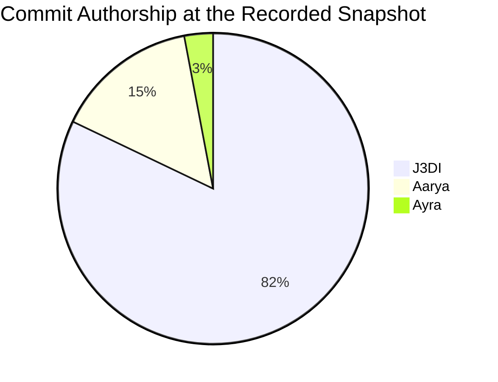

# Team Ownership & Contributions

**Last updated:** 2026-09-13

**Repository snapshot:** `6428570` on branch `main`

**Commit count:** 67

This record combines author names that use the same verified email identity. In
particular, `J3DI` and `J3DI-19` are reported together as J3DI.

## J3DI

**Role:** Project Lead

**Assigned steps:** 01, 02, 09, 10, plus cross-cutting integration and delivery

**Verified commits:** 55

### Allocated project-wide ownership

- Documentation, planning, roadmap management, and team coordination
- Repository foundation, frontend architecture, merging, and integration review
- Final product polish, evaluation-data readiness, and release management

### Verified contribution record

- **Leadership:** Led implementation planning, work sequencing, roadmap
  management, review preparation, and end-to-end delivery oversight.
- **Foundation and frontend:** Established the repository, React/Vite frontend,
  FastAPI backend, SQLite integration, Ollama configuration, application shell,
  dashboards, case workspaces, timelines, graphs, and investigation views.
- **Evidence-analysis improvements:** Added explicit classification provenance,
  normalized attack taxonomy, label-free HAI and IoT-23 detection, metric and
  network behavioural rules, risk transparency, bounded incident grouping,
  activity-window attribution, and safe cross-dataset convergence.
- **Dataset workflows:** Added curated HAI, IoT-23, TON_IoT, CASAS, and simulation
  samples; contract fixtures; checksums; preparation tooling; and a physical
  device inventory that distinguishes sensors, appliances, network flows, and
  cameras.
- **Investigation usability:** Added dense-timeline pagination, spike-cause
  explanations, incident context, entity inventory, classification/risk
  explainers, reliable route transitions, and improved mixed-case analysis.
- **Case explanation UX:** Added automatically maintained, beginner-friendly
  dataset descriptions, preserved investigator-written text, concise hover text
  in case management, and a full responsive description panel in Case Overview.
- **Safe investigation visualizations:** Completed the versioned deterministic
  visualization boundary, historical snapshot pinning, backend dataset resolver,
  message-linked canvas, focused six-view selector, ranked entity/finding views,
  severity pie chart, safe fallbacks, and deterministic Automatic routing.
- **Grounded AI investigation chat:** Completed durable case/reference-scoped
  conversations, bounded retrieval, verified citations, natural non-evidence
  chat, case-name resolution, offline deterministic answers, history restoration,
  scrolling, cancellation, retry, and per-response visual controls.
- **Local AI operations and performance:** Added independent AI-generation and
  Ollama runtime controls, model/context/request details in System Status,
  shorter prompt/history budgets, bounded output, model keep-alive, and clearer
  failure-state reporting.
- **Assistant workspace UX:** Rebuilt the investigation chat as a compact,
  readable two-pane workspace with a reduced global shell, unified controls,
  improved scrolling, clearer message presentation, and a cleaner visual canvas.
- **Interactive visual workspace:** Preserved multiple response visuals until
  explicitly closed, added drag reordering, compact close and zoom controls,
  focused full-size previews, stronger chart readability, and consistent native
  dropdown styling across scope, history, and visual selection.
- **Mainline delivery:** Opened and merged PR #17, bringing all nine Step 9–10
  implementation, documentation, reliability, performance, and UI commits from
  `J3DI` into `main` after the required CI checks passed.

### Most recent verified commits

- `254e84f` (2026-09-12) — **Polish assistant visuals and controls.** Added
  focused visual previews, clearer chart and visual-panel presentation, improved
  drag/zoom/close controls, a refined evidence checkbox, and one consolidated,
  readable style path for all three assistant dropdowns.
- `3213ca1` (2026-09-12) — **Keep assistant visuals open across responses.**
  Changed the canvas from single-response replacement to persistent multi-visual
  state, retaining each visual until the investigator closes it.
- `96320b3` (2026-09-12) — **Revamp investigation assistant workspace.**
  Reworked the page into a minimal chat-first layout, simplified its headers and
  surrounding shell, improved readability and scrolling, and introduced the
  interactive visual workspace.
- `a1962a2` (2026-09-12) — **Improve assistant reliability and investigation
  visuals.** Added the focused six-view analysis set, real severity pie, ranked
  top entities and findings, deterministic Automatic routing, stronger chat
  behavior, and live-tested persisted visualization selection.
- `0ed5a36` (2026-09-11) — **Improve assistant chat controls and performance.**
  Added explicit evidence/visual controls, durable history behavior, reduced
  context and output budgets, faster polling, and message-linked visual state.
- `4a545a7` (2026-09-10) — **Add local AI runtime controls and harden
  assistant.** Separated AI generation from Ollama process status, exposed model
  and context details, and strengthened runtime and fallback checks.
- `9e03217` (2026-09-10) — **Complete grounded investigation chat.** Delivered
  persisted scoped sessions, bounded evidence retrieval, safe Qwen narration,
  verified references, history, and deterministic offline completion.
- `7e56850` (2026-09-10) — **Complete safe investigation visualizations.**
  Delivered versioned allow-listed layouts, deterministic data references,
  persisted resolvers, connected renderers, fallbacks, and snapshot pinning.
- `42efe68` (2026-09-09) — **Add dataset-aware case descriptions.** Added the
  plain-language source catalog, automatic description creation/backfill,
  mixed-source explanation logic, compact hover presentation, the Case Overview
  information panel, and regression tests.
- `c4ec731` (2026-09-09) — **Improve evidence analysis and dataset workflows.**
  Added label-free HAI/IoT-23 workflows, curated samples, device documentation,
  classification provenance, behavioural rules, bounded incident sessions,
  anomaly attribution, cross-source analysis improvements, frontend explainers,
  timeline scaling, start-up tooling, and supporting tests/documentation.

### Earlier major commits

- `4f00e8f` (2026-09-02) — Complete Phase 2 recovery workflows
- `7ecdc12` (2026-09-01) — Complete Phase 1 usability workflows
- `d08598e` (2026-08-15) — Complete end-to-end investigation integration
- `8e6500c` (2026-07-23) — Refine Traceveil investigation frontend
- `72339f4` (2026-07-19) — Initialize Sentinel Step 1 foundation

---

## Aarya

**Role:** Contributor

**Assigned steps:** 03, 04, 06, 08

**Verified commits:** 10

### Verified contribution record

- **Evidence validation:** Implemented evidence schemas, profiles, hashing,
  validation rules, persistence/migrations, dataset fixtures, and live telemetry
  contracts.
- **Canonical normalization:** Built versioned canonical events, deterministic
  IDs, provenance tracking, simulation/network adapters, and integrity checks.
- **Deterministic analytics:** Implemented filters, sorting, initial detection
  rules, baselines, bounded risk scoring, correlation, incident grouping, and
  live alerts.

### Major commits

- `77ed34e` (2026-09-01) — Complete Step 8 investigation workflows
- `df03b84` (2026-08-21) — Integrate Step 8 investigation APIs
- `b4d2337` (2026-08-11) — Step 6 deterministic analytics
- `72ad28c` (2026-08-07) — Step 4 canonical normalization
- `66b43fe` (2026-08-06) — Step 3 evidence validation

---

## Ayra

**Role:** Contributor

**Assigned steps:** 05, 07, 11, 12

**Verified commits:** 2

### Verified contribution record

- **Live IoT integration:** Contributed authenticated HTTP intake, session and
  telemetry integration work, follow-up fixes, and CI/CD corrections for Step 5.

### Major commits

- `3118068` (2026-09-06) — Step 5 contribution
- `8b79d0a` (2026-09-02) — Step 5 foundation

## Attribution note

Counts above come from `git shortlog -sne main` at `6428570`. The J3DI total
combines 42 commits authored as `J3DI` and 13 authored as `J3DI-19`, which share
the verified `j3di.legend@gmail.com` identity. Feature ownership
is based on the committed diff and the agreed assigned steps; a checked roadmap
item records delivery ownership and does not erase earlier foundational work by
another contributor.
